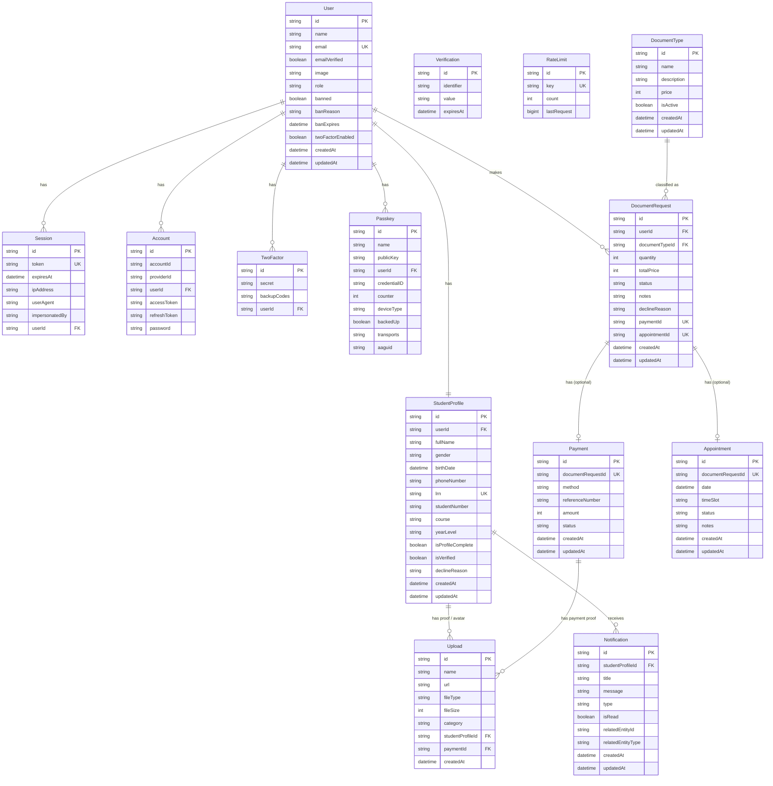

# OneClickCredentials — Entity Relationship Diagram



## Entity Relationship Summary

```
User (1) ──── (1) StudentProfile
User (1) ──── (N) DocumentRequest
User (1) ──── (N) Session, Account, TwoFactor, Passkey

StudentProfile (1) ──── (N) Upload (via studentProfileId)
StudentProfile (1) ──── (N) Notification

DocumentType (1) ──── (N) DocumentRequest

DocumentRequest (1) ──── (1) Payment        ← 1:1 optional
DocumentRequest (1) ──── (1) Appointment    ← 1:1 optional
DocumentRequest (N) ──── (1) User
DocumentRequest (N) ──── (1) DocumentType

Payment (1) ──── (N) Upload (via paymentId)
```

## Status Lifecycles

```
DocumentRequest:  Pending → Processing → Ready → Completed
                                          ↘ Rejected / Cancelled

Payment:          Pending → Paid
                           ↘ Failed / Refunded

Appointment:      Scheduled → Completed
                             ↘ Cancelled / No-show
```

## Key Design Notes

- **Payment** is already in the schema with a 1:1 relation to `DocumentRequest`, but the UI/controller logic for online payment gateways (GCash, Maya, etc.) is **not yet implemented**. The current flow supports Cash (default) with manual proof upload via UploadThing.
- `DocumentRequest.paymentId` and `DocumentRequest.appointmentId` are **nullable** — the Payment and Appointment records are created later in the workflow (after admin marks a request as Ready).
- All monetary values (`price`, `totalPrice`, `amount`) are stored as **integers** (whole pesos/cents — no decimals).
- The `Upload` table is polymorphic — it can belong to either a `StudentProfile` (enrollment proof, avatar) or a `Payment` (payment receipt), controlled by the `category` field.
